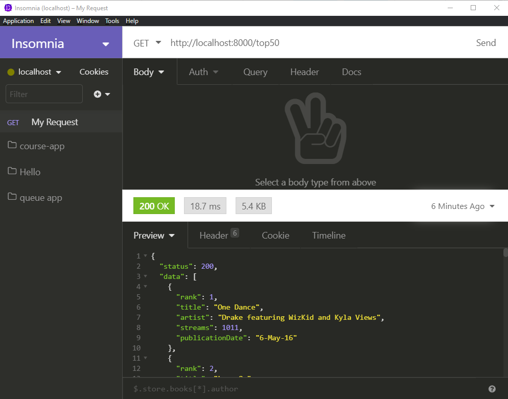

# Exercise 2 - `/top50` endpoint

Create an endpoint that

- will respond to `get` requests for data.
- will serve up all of the song data in `/backend/data/top50.js`.

The server response should have this shape (as it is what the FE expects):

```json
{
  "status": 200,
  "data": [
    {
      "rank": 1,
      "title": "One Dance",
      "artist": "Drake featuring WizKid and Kyla Views",
      "streams": 1011,
      "publicationDate": "6-May-16"
    }
    // the rest of the data...
  ]
}
```

You will need to create the endpoint in the `server.js` file.

Test your endpoint with insomnia.


