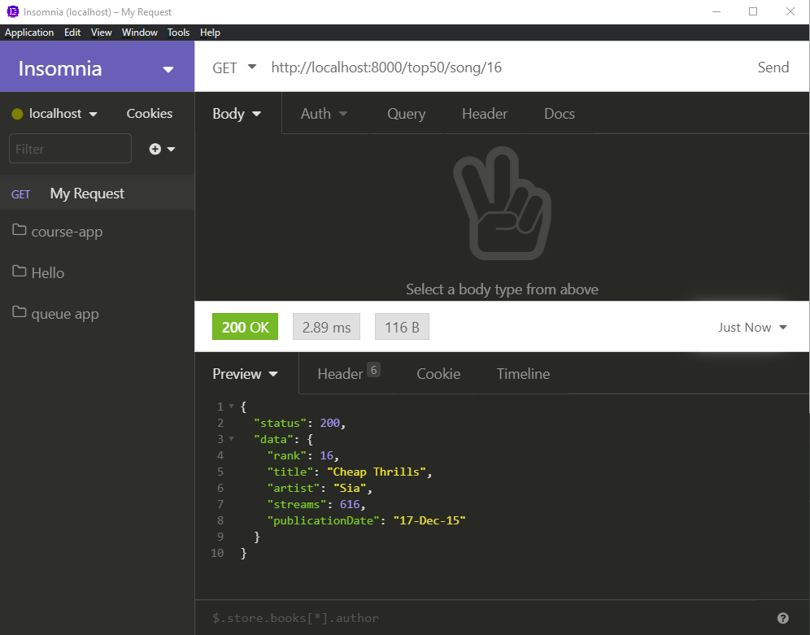

# Exercise 3 - `GET`ting a specific song

Create an endpoint that will respond with a specific song, based on the rank provided in the URL.

This `/top50/song/32` should respond with

```json
{
  "status": 200,
  "data": {
    "rank": 32,
    "title": "Me Myself & I",
    "artist": "G-Eazy and Bebe Rexha",
    "streams": 538,
    "publicationDate": "14-Oct-15"
  }
}
```

If the rank provided doesn't exist in the data, return a `404`.

```json
{
  "status": 404,
  "message": "Song not found."
}
```

_If you suddenly feel like you should create 50 different endpoints, **STOP**. That is NOT the solution._

Test your endpoint in insomnia.


