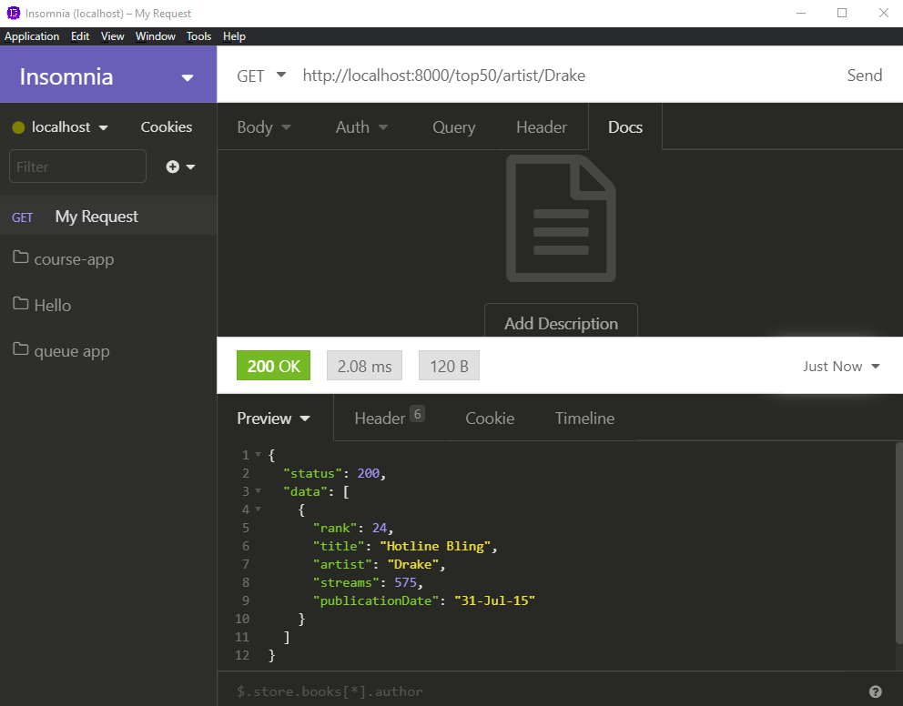

# Exercise 4 - `GET`ting songs by a specific artist

Create an endpoint that will reposnd with all of the songs by a specific artist (provided in the URL).

This `top50/artist/drake` should respond with

```json
{
  "status": 200,
  "data": [
    {
      "rank": 24,
      "title": "Hotline Bling",
      "artist": "Drake",
      "streams": 575,
      "publicationDate": "31-Jul-15"
    }
  ]
}
```

If the artist is not found, return a 404.


