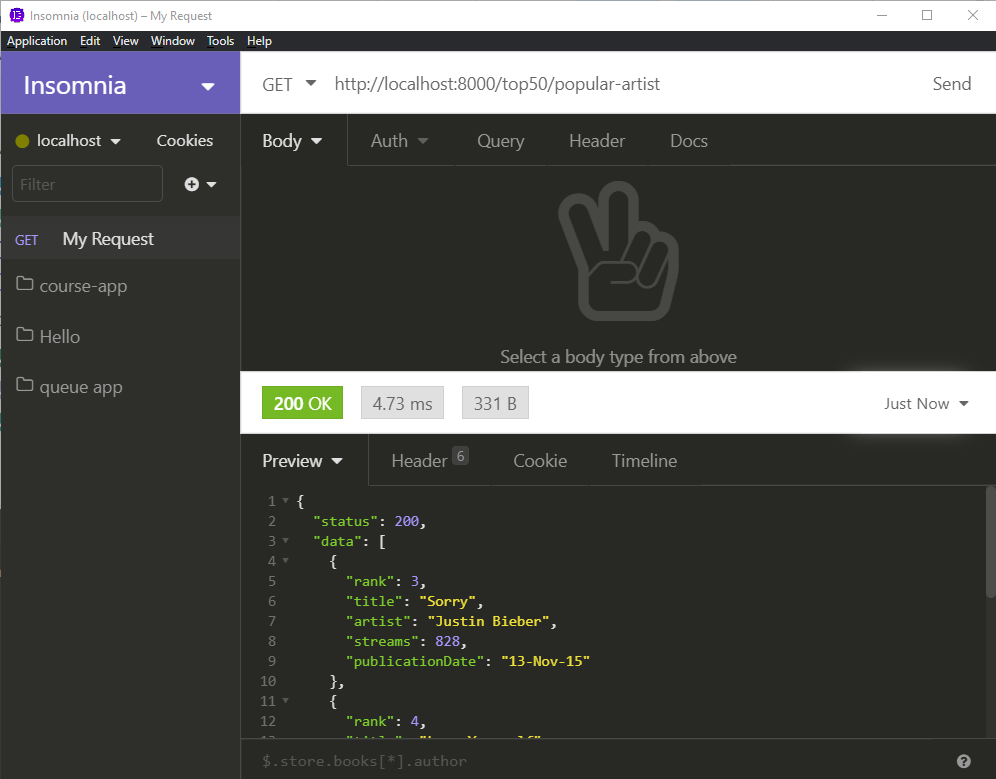

# Exercise 5 - The Most popular artist is...

The server needs an endpoint that will analyze the top50 data and return the songs of the most popular artist (the artist with the most songs in the top 50.)

This endpoint will need a little more JS than the others.

**HINT:** It's Justin Bieber. Really.

