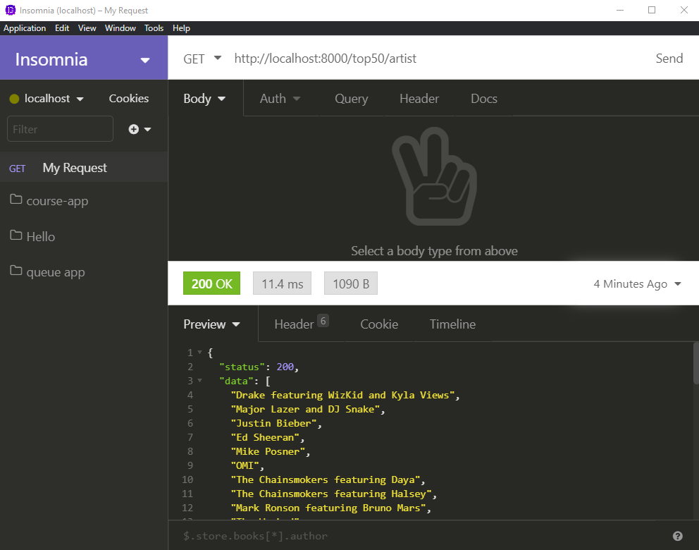

# Exercise 6 - Array of Artists

The frontend needs an array of all of the artists in the top 50. Create an endpoint `/top50/artist` that will respond with this array. _The array should only contain artist name, and no duplicates._

**HINT:** You can look into a new ES6 feature `new Set()` that has a side-effect of filtering out duplicates. [Mozilla Documentation](https://developer.mozilla.org/en-US/docs/Web/JavaScript/Reference/Global_Objects/Set).

