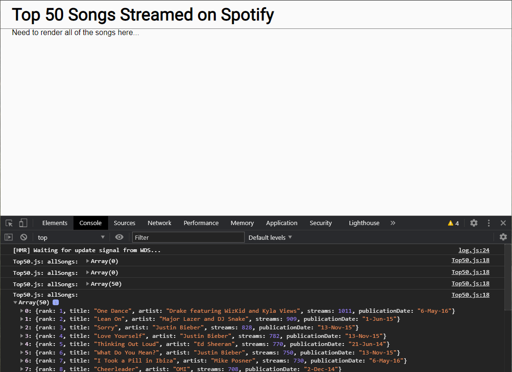
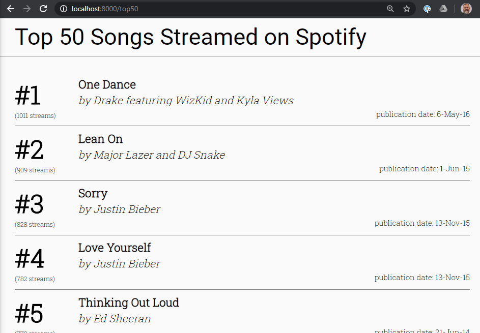

# Exercise 7 - Render the top 50 songs

If you go to `http://localhost:3000`, you will notice that the songs are not rendered to the screen. Take a look at the console, you should be able to see the list of songs consoled there.

#### Guidelines for this exercise:

- Create a new component called `SongList` that will render a `ul`. Pass it a prop of `songs`.
- Create a new component called `SongListItem` that will render a `li`. Pass it a prop of `song`.
- Style the components to match the screenshot below as closely as possible.
- We want to be able to use these components in the next exercise.

This is what we should see once you're done:

