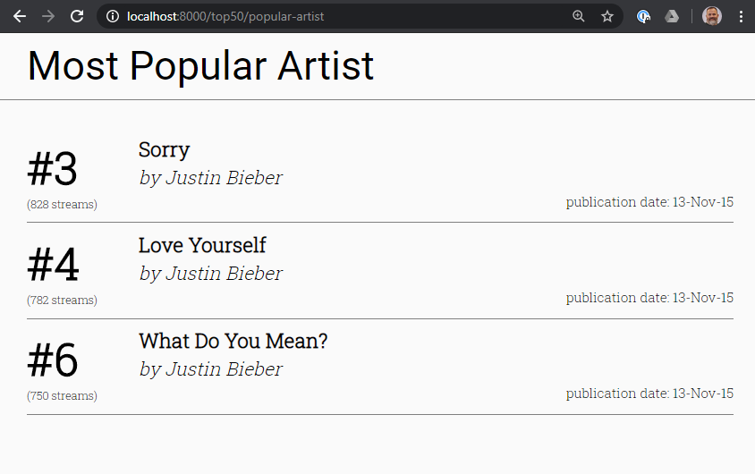

# Exercise 8 - Render the songs by the most popular artist

Open `components/PopularArtistPage.js` and modify the code to render all of the songs that this page receives. _Check the console to see the data._ You shouldn't have to create anymore components. It should be possible to re-use the components that you wrote in exercise 7.

